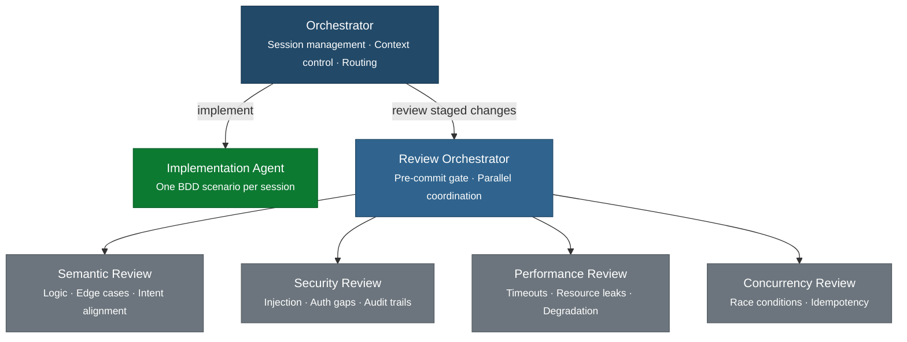

Standard pre-commit tooling catches mechanical defects. The agent configuration described here
covers what standard tooling cannot: semantic logic errors, subtle security patterns, missing
timeout propagation, and concurrency anti-patterns. Both layers are required. Neither replaces
the other.

For the pre-commit gate sequence this configuration enforces, see the
Pipeline Reference Architecture.
For the defect sources each gate addresses, see the
Systemic Defect Fixes catalog.

## System Architecture

The coding agent system has two tiers. The orchestrator manages sessions and routes work.
Specialized agents execute within a session's boundaries. Review sub-agents run in parallel
as a pre-commit gate, each responsible for exactly one defect concern.

**Separation principle:** The orchestrator does not write code. The implementation agent
does not review code. Review agents do not modify code. Each agent has one responsibility.
This is the same separation of concerns that pipeline enforcement
applies at the CI level - brought to the pre-commit level.

**Every agent boundary is a token budget boundary.** What the orchestrator passes to the
implementation agent, what it passes to the review orchestrator, and what each sub-agent
receives and returns are all token cost decisions. The configuration below applies the
tokenomics strategies concretely: model routing by task complexity,
structured outputs between agents, prompt caching through stable system prompts placed
first in each context, and minimum-necessary-context rules at every boundary.

This page defines the configuration for each component in order: [Orchestrator](#the-orchestrator), [Implementation Agent](#the-implementation-agent), [Review Orchestrator](#the-review-orchestrator), and four [Review Sub-Agents](#review-sub-agents). The [Skills](#skills) section defines the session procedures each component uses. The [Hooks](#hooks) section defines the pre-commit gate sequence. The [Token Budget](#token-budget) section applies the tokenomics strategies to this configuration.

---

## The Orchestrator

The orchestrator manages session lifecycle and controls what context each agent receives.
It does not generate implementation code. Its job is routing and context hygiene.

**Recommended model tier:** Small to mid. The orchestrator routes, assembles context, and
writes session summaries. It does not reason about code. A frontier model here wastes tokens
on a task that does not require frontier reasoning. Claude: Haiku. Gemini: Flash.

**Responsibilities:**

- Initialize each session with the correct context subset (per
  Small-Batch Sessions)
- Delegate implementation to the implementation agent
- Trigger the review orchestrator when the implementation agent reports completion
- Write the session summary on commit and reset context for the next session
- Enforce the pipeline-red rule (ACD constraint 8):  if the pipeline is failing,
  route only to pipeline-restore mode; block new feature work

**Rules injected into the orchestrator system prompt.** The context assembly order below follows the general pattern from Configuration Quick Start: Context Loading Order, applied to this specific agent configuration:

## Orchestrator Rules

You manage session context and routing. You do not write implementation code.

Output verbosity: your responses are status updates. State decisions and actions in one
sentence each. Do not explain your reasoning unless asked.

On session start - assemble context in this order (earlier items are stable and cache
across sessions; later items change each session):
1. Implementation agent system prompt rules [stable - cached]
2. Feature description [stable within a feature - often cached]
3. BDD scenario for this session [changes per session]
4. Relevant existing files - only files the scenario will touch [changes per session]
5. Prior session summary [changes per session]

Do NOT include:
- Full conversation history from prior sessions
- BDD scenarios for sessions other than the current one
- Files unlikely to change in this session

Before passing context to the implementation agent, confirm each item passes this test:
would omitting it change what the agent does? If no, omit it.

On implementation complete:
- Invoke the review orchestrator with: staged diff, current BDD scenario, feature
  description. Nothing else.
- Do not proceed to commit if the review orchestrator returns "decision": "block"

On pipeline failure:
- Route only to pipeline-restore mode
- Block new feature implementation until the pipeline is green

On commit:
- Write a context summary using the format defined in Small-Batch Sessions
- This summary replaces the full session conversation for future sessions
- Reset context after writing the summary; do not carry conversation history forward

---

## The Implementation Agent

The implementation agent generates test code and production code for the current BDD scenario.
It operates within the context the orchestrator provides and does not reach outside that context.

**Recommended model tier:** Mid to frontier. Code generation and test-first implementation
require strong reasoning. This is the highest-value task in the session - invest model
capability here. Output verbosity should be controlled explicitly: the agent returns code
only, not explanations or rationale, unless the orchestrator requests them. Claude: Sonnet
or Opus. Gemini: Pro.

**Receives from the orchestrator:**

- Intent summary
- The one BDD scenario for this session
- Feature description (constraints, architecture, performance budgets)
- Relevant existing files
- Prior session summary

**Rules injected into the implementation agent system prompt:**

## Implementation Rules

You implement exactly one BDD scenario per session. No more.

Output verbosity: return code changes only. Do not include explanation, rationale,
alternative approaches, or implementation notes. If you need to flag a concern, state
it in one sentence prefixed with CONCERN:. The orchestrator will decide what to do with it.

Context hygiene: analyze and modify only the files provided in your context. If you
identify a file you need that was not provided, request it with this format and wait:
  CONTEXT_NEEDED: [filename] - [one sentence why]
Do not infer, guess, or reproduce the contents of files not in your context.

Implementation:
- Write the acceptance test for this scenario before writing production code
- Do not modify test specifications; tests define behavior, you implement to them
- Do not implement behavior from other scenarios, even if it seems related
- Flag any conflict between the scenario and the feature description to the
  orchestrator; do not resolve it yourself

Done when: the acceptance test for this scenario passes, all prior acceptance tests
still pass, and you have staged the changes.

---

## The Review Orchestrator

The review orchestrator runs between implementation complete and commit. It invokes all
four review sub-agents in parallel against the staged diff, collects their findings, and
returns a single structured decision.

**Recommended model tier:** Small. The review orchestrator does no reasoning itself - it
invokes sub-agents and aggregates their structured output. A small model handles this
coordination cheaply. Claude: Haiku. Gemini: Flash.

**Receives:**

- The staged diff for this session
- The BDD scenario being implemented (for intent alignment checks)
- The feature description (for architectural constraint checks)

**Returns:** A JSON object so the orchestrator can parse findings without a natural language
step. Structured output here eliminates ambiguity and reduces the token cost of the
aggregation step.

{
  "decision": "pass | block",
  "findings": [
    {
      "agent": "semantic | security | performance | concurrency",
      "file": "path/to/file.ts",
      "line": 42,
      "issue": "one-sentence description of what is wrong",
      "why": "one-sentence explanation of the failure mode it creates"
    }
  ]
}

An empty `findings` array with `"decision": "pass"` means all sub-agents passed. A
non-empty `findings` array always accompanies `"decision": "block"`.

**Rules injected into the review orchestrator system prompt:**

## Review Orchestrator Rules

You coordinate parallel review sub-agents. You do not review code yourself.

Output verbosity: return exactly the JSON schema below. No prose before or after it.

Context passed to each sub-agent - minimum necessary only:
- Semantic agent: staged diff + BDD scenario
- Security agent: staged diff only
- Performance agent: staged diff + feature description (performance budgets only)
- Concurrency agent: staged diff only

Do not pass the full session context to sub-agents. Each sub-agent receives only what
its specific check requires.

Execution:
- Invoke all four sub-agents in parallel
- A single sub-agent block is sufficient to return "decision": "block"
- Aggregate sub-agent findings into the findings array; add the agent field to each

Return this JSON and nothing else:
{
  "decision": "pass | block",
  "findings": [
    {
      "agent": "semantic | security | performance | concurrency",
      "file": "path/to/file",
      "line": <line number>,
      "issue": "<one sentence>",
      "why": "<one sentence>"
    }
  ]
}

---

## Review Sub-Agents

Each sub-agent covers exactly one defect concern from the
Systemic Defect Fixes catalog. They receive only the diff and the
artifacts relevant to their specific check - not the full session context.

### Semantic Review Agent

**Recommended model tier:** Mid to frontier. Logic correctness and intent alignment require
genuine reasoning - a model that can follow execution paths, infer edge cases, and compare
implementation against stated intent. Claude: Sonnet or Opus. Gemini: Pro.

**Defect sources addressed:**

- Reliance on human review to catch preventable defects
  (Process & Deployment)
- Implicit domain knowledge not in code
  (Knowledge & Communication)
- Untested edge cases and error paths
  (Testing & Observability Gaps)

**What it checks:**

- Logic correctness: does the implementation produce the outputs the scenario specifies?
- Edge case coverage: does the implementation handle boundary values and error paths, or
  only the happy path the scenario explicitly describes?
- Intent alignment: does the implementation address the problem stated in the intent
  summary, or does it technically satisfy the test while missing the point?
- Test coupling: does the test verify observable behavior, or does it assert on
  implementation internals? (See Implementation Coupling Agent)

**System prompt rules:**

## Semantic Review Agent Rules

You review code for logical correctness and edge case coverage.
You do not modify code. You report findings only.

Output verbosity: return only the JSON below. No prose, no analysis narrative.

Scope: analyze only code present in the diff. Do not reason about code not in the diff.
Early exit: if the diff contains no logic changes (formatting or comments only),
return {"decision": "pass", "findings": []} immediately without analysis.

Check:
- Does the implementation match what the BDD scenario specifies?
- Are there code paths the tests do not exercise?
- Will the logic fail on boundary values not covered by the scenario?
- Does the test verify observable behavior, or internal implementation state?

Do not flag style issues (linter) or security issues (security agent).

Return this JSON and nothing else:
{
  "decision": "pass | block",
  "findings": [
    {"file": "<path>", "line": <n>, "issue": "<one sentence>", "why": "<one sentence>"}
  ]
}

### Security Review Agent

**Recommended model tier:** Mid to frontier. Identifying second-order injection, subtle
authorization gaps, and missing audit events requires understanding data flow semantics,
not just pattern matching. A smaller model will miss the cases that matter most. Claude:
Sonnet or Opus. Gemini: Pro.

**Defect sources addressed:**

- Injection vulnerabilities (subtle patterns beyond basic SAST)
  (Security & Compliance)
- Authentication and authorization gaps
  (Security & Compliance)
- Missing audit trails
  (Security & Compliance)

**What it checks:**

- Second-order injection and injection vectors that pattern-matching SAST rules miss
- Code paths that process user-controlled input without validation at the boundary
- State-changing operations that lack an authorization check
- State-changing operations that do not emit a structured audit event
- Privilege escalation patterns

**Context it receives:**

- Staged diff only; no broader system context needed

**System prompt rules:**

## Security Review Agent Rules

You review code for security defects that SAST tools do not catch.
You do not replace SAST; you extend it for semantic patterns.

Output verbosity: return only the JSON below. No prose, no analysis narrative.

Scope: analyze only code present in the diff. You receive the diff only - do not
request broader system context.
Early exit: if the diff introduces no code that processes external input and no
state-changing operations, return {"decision": "pass", "findings": []} immediately.

Check:
- Injection vectors requiring data flow understanding: second-order injection,
  type coercion attacks, deserialization vulnerabilities
- State-changing operations without an authorization check
- State-changing operations without a structured audit event
- Privilege escalation patterns

Do not flag vulnerabilities detectable by standard SAST pattern-matching;
those are handled by the SAST hook before this agent runs.

Return this JSON and nothing else:
{
  "decision": "pass | block",
  "findings": [
    {"file": "<path>", "line": <n>, "issue": "<one sentence>",
     "why": "<one sentence>", "cwe": "<CWE-NNN or OWASP category>"}
  ]
}

### Performance Review Agent

**Recommended model tier:** Small to mid. Timeout and resource leak detection is primarily
structural pattern recognition: find external calls, check for timeout configuration, trace
resource allocations to their cleanup paths. A small to mid model handles this well and runs
cheaply enough to be invoked on every commit without concern. Claude: Haiku or Sonnet.
Gemini: Flash.

**Defect sources addressed:**

- Missing timeout and deadline enforcement
  (Performance & Resilience)
- Resource leaks
  (Performance & Resilience)
- Missing graceful degradation
  (Performance & Resilience)

**What it checks:**

- External calls (HTTP, database, queue, cache) without timeout configuration
- Timeout values that are set but not propagated through the call chain
- Resource allocations (connections, file handles, threads) without corresponding cleanup
- Calls to external dependencies with no fallback or circuit breaker when the feature
  description specifies a resilience requirement

**Context it receives:**

- Staged diff
- Feature description (for performance budgets and resilience requirements)

**System prompt rules:**

## Performance Review Agent Rules

You review code for timeout, resource, and resilience defects.

Output verbosity: return only the JSON below. No prose, no analysis narrative.

Scope: analyze only external call sites and resource allocations present in the diff.
Early exit: if the diff introduces no external calls and no resource allocations,
return {"decision": "pass", "findings": []} immediately without analysis.

Check:
- External calls (HTTP, database, queue, cache) without a configured timeout
- Timeouts set at the entry point but not propagated to nested calls in the same path
- Resource allocations without a matching cleanup in both success and failure branches
- If the feature description specifies a latency budget: synchronous calls in the hot
  path that could exceed it

Do not flag performance characteristics that require benchmarks to measure;
those are handled at CD Stage 2.

Return this JSON and nothing else:
{
  "decision": "pass | block",
  "findings": [
    {"file": "<path>", "line": <n>, "issue": "<one sentence>", "why": "<one sentence>"}
  ]
}

### Concurrency Review Agent

**Recommended model tier:** Mid. Concurrency defects require reasoning about execution
ordering and shared state - more than pattern matching but less open-ended than security
semantics. A mid-tier model balances reasoning depth and cost here. Claude: Sonnet.
Gemini: Pro.

**Defect sources addressed:**

- Race conditions (anti-patterns beyond thread sanitizer detection)
  (Integration & Boundaries)
- Concurrency and ordering issues
  (Data & State)

**What it checks:**

- Shared mutable state accessed from concurrent paths without synchronization
- Operations that assume a specific ordering without enforcing it
- Anti-patterns that thread sanitizers cannot detect at static analysis time:
  check-then-act sequences, non-atomic read-modify-write operations, and missing
  idempotency in message consumers

**System prompt rules:**

## Concurrency Review Agent Rules

You review code for concurrency defects that static tools cannot detect.

Output verbosity: return only the JSON below. No prose, no analysis narrative.

Scope: analyze only shared state accesses and message consumer code in the diff.
Early exit: if the diff introduces no shared mutable state and no message consumer
or event handler code, return {"decision": "pass", "findings": []} immediately.

Check:
- Shared mutable state accessed from code paths that can execute concurrently
- Operations that assume a specific execution order without enforcing it
- Check-then-act sequences and non-atomic read-modify-write operations
- Message consumers or event handlers that are not idempotent when system
  constraints require idempotency

Do not flag thread safety issues that null-safe type systems or language
immutability guarantees already prevent.

Return this JSON and nothing else:
{
  "decision": "pass | block",
  "findings": [
    {"file": "<path>", "line": <n>, "issue": "<one sentence>", "why": "<one sentence>"}
  ]
}

---

## Skills

Skills are reusable session procedures invoked by name. They encode the session discipline
from Small-Batch Sessions so the orchestrator does not have to
re-derive it each time. A normal session runs `/start-session`, then `/review`, then `/end-session`. Use `/fix` only when the pipeline fails mid-session.

### `/start-session`

Loads the session context and prepares the implementation agent.

## /start-session

Assemble the implementation agent's context in this order. Order matters: stable
content first maximizes prompt cache hits; dynamic content at the end.

1. Implementation agent system prompt rules [stable across all sessions - cached]
2. Feature description [stable within this feature - often cached]
3. Intent description summarized to 2 sentences [changes per feature]
4. BDD scenario for this session only - not the full scenario list [changes per session]
5. Prior session summary if one exists [changes per session]
6. Existing files the scenario will touch - read only those files [changes per session]

Before passing to the implementation agent, apply the context hygiene test to each
item: would omitting it change what the agent produces? If no, omit it.

Present the assembled context to the user for confirmation, then invoke the
implementation agent.

### `/review`

Invokes the review orchestrator against all staged changes.

## /review

Run the pre-commit review gate:
1. Collect all staged changes as a unified diff
2. Assemble the review orchestrator's context in this order:
   a. Review orchestrator system prompt rules [stable - cached]
   b. Feature description [stable within this feature - often cached]
   c. Current BDD scenario [changes per session]
   d. Staged diff [changes per call]
3. Pass only this assembled context to the review orchestrator.
   Do not pass the full session conversation or implementation agent history.
4. The review orchestrator returns JSON. Parse the JSON directly; do not
   re-summarize its findings in prose.
5. If "decision" is "block", pass the findings array to the implementation
   agent for resolution. Include only the findings, not the full review context.
6. Do not proceed to commit until /review returns {"decision": "pass"}.

### `/end-session`

Closes the session, validates all gates, writes the summary, and commits.

## /end-session

Complete the session:
1. Confirm the pre-commit hook passed (lint, type-check, secret-scan, SAST)
2. Confirm /review returned {"decision": "pass"}
3. Confirm the pipeline is green (all prior acceptance tests pass)
4. Write the context summary using the format from Small-Batch Sessions.
   This summary replaces the full session conversation in future contexts;
   keep it under 150 words.
5. Commit with a message referencing the scenario name
6. Reset context. The session summary is the only artifact that carries forward.
   The full conversation, implementation details, and review findings do not.

### `/fix`

Enters pipeline-restore mode when the pipeline is red.

## /fix

Enter pipeline-restore mode. Load minimum context only.

1. Identify the failure: which stage failed, which test, which error message
2. Load only:
   a. Implementation agent system prompt rules [cached]
   b. The failing test file
   c. The source file the test exercises
   d. The prior session summary (for file locations and what was built)
   Do not reload the full feature description, BDD scenario list, or session history.
3. Invoke the implementation agent in restore mode with this context.
   Rules for restore mode:
   - Make the failing test pass; introduce no new behavior
   - Modify only the files implicated in the failure
   - Flag with CONCERN: if the fix requires touching files not in context
4. Run /review on the fix. Pass only the fix diff, not the restore session history.
5. Confirm the pipeline is green. Exit restore mode and return to normal session flow.

---

## Hooks

Hooks run automatically as part of the commit process. They execute standard tooling -
fast, deterministic, and free of AI cost - before the review orchestrator runs.
The review orchestrator only runs if the hooks pass.

**Pre-commit hook sequence:**

pre-commit:
  steps:
    - name: lint-and-format
      run: <your-linter> --check
      on-fail: block-commit
      maps-to: "Linting and formatting [Process & Deployment]"

    - name: type-check
      run: <your-type-checker>
      on-fail: block-commit
      maps-to: "Static type checking [Data & State]"

    - name: secret-scan
      run: <your-secret-scanner>
      on-fail: block-commit
      maps-to: "Secrets committed to source control [Security & Compliance]"

    - name: sast
      run: <your-sast-tool>
      on-fail: block-commit
      maps-to: "Injection vulnerabilities - pattern matching [Security & Compliance]"

    - name: accessibility-lint
      run: <your-a11y-linter>
      on-fail: warn
      maps-to: "Inaccessible UI [Product & Discovery]"

    - name: ai-review
      run: invoke /review
      depends-on: [lint-and-format, type-check, secret-scan, sast]
      on-fail: block-commit
      maps-to: "Semantic, security (beyond SAST), performance, concurrency"

**Why the hook sequence matters:** Standard tooling runs first because it is faster and
cheaper than AI review. If the linter fails, there is no reason to invoke the review
orchestrator. Deterministic checks fail fast; AI review runs only on changes that pass
the baseline mechanical checks.

---

## Token Budget

**A rising per-session cost with a stable block rate means context is growing unnecessarily. A rising block rate without rising cost means the review agents are finding real issues without accumulating noise.** Track these two signals and the cause of any cost increase becomes immediately clear.

The tokenomics strategies apply directly to this configuration. Three
decisions have the most impact on cost per session.

### Model routing

Matching model tier to task complexity is the highest-leverage cost decision. Applied to
this configuration:

| Agent | Recommended Tier | Claude | Gemini | Why |
|-------|-----------------|--------|--------|-----|
| Orchestrator | Small to mid | Haiku | Flash | Routing and context assembly; no code reasoning required |
| Implementation Agent | Mid to frontier | Sonnet or Opus | Pro | Core code generation; the task that justifies frontier capability |
| Review Orchestrator | Small | Haiku | Flash | Coordination only; returns structured output from sub-agents |
| Semantic Review | Mid to frontier | Sonnet or Opus | Pro | Logic and intent reasoning; requires genuine inference |
| Security Review | Mid to frontier | Sonnet or Opus | Pro | Security semantics; pattern-matching is insufficient |
| Performance Review | Small to mid | Haiku or Sonnet | Flash | Structural pattern recognition; timeout and resource signatures |
| Concurrency Review | Mid | Sonnet | Pro | Concurrent execution semantics; more than patterns, less than security |

Running the implementation agent on a frontier model and routing the review orchestrator
and performance review agent to smaller models cuts the token cost of a full session
substantially compared to using one model for everything.

### Prompt caching

Each agent's system prompt rules block is stable across every invocation. Place it at the
top of every agent's context - before the diff, before the session summary, before any
dynamic content. This structure allows the server to cache the rules prefix and amortize
its input cost across repeated calls.

The `/start-session` and `/review` skills assemble context in this order:

1. Agent system prompt rules (stable - cached)
2. Feature description (stable within a feature - often cached)
3. BDD scenario for this session (changes per session)
4. Staged diff or relevant files (changes per call)
5. Prior session summary (changes per session)

### Measuring cost per session

Track token spend at the session level, not the call level. A session that costs 10x the
average is a design problem - usually an oversized context bundle passed to the implementation
agent, or a review sub-agent receiving more content than its check requires.

Metrics to track per session:

- Total input tokens (implementation agent call + review sub-agent calls)
- Total output tokens (implementation output + review findings)
- Review block rate (how often the session cannot commit on first pass)
- Tokens per retry (cost of each implementation-review-fix cycle)

See Tokenomics for the full measurement framework.

---

## Defect Source Coverage

This table maps each pre-commit defect source to the mechanism that covers it.

| Defect Source | Catalog Section | Covered By |
|---------------|-----------------|------------|
| Code style violations | Process & Deployment | Lint hook |
| Null/missing data assumptions | Data & State | Type-check hook |
| Secrets in source control | Security & Compliance | Secret-scan hook |
| Injection (pattern-matching) | Security & Compliance | SAST hook |
| Accessibility (structural) | Product & Discovery | Accessibility-lint hook |
| Race conditions (detectable) | Integration & Boundaries | Thread sanitizer (language-specific) |
| Logic errors, edge cases | Process & Deployment | Semantic review agent |
| Implicit domain knowledge | Knowledge & Communication | Semantic review agent |
| Untested paths | Testing & Observability Gaps | Semantic review agent |
| Injection (semantic/second-order) | Security & Compliance | Security review agent |
| Auth/authz gaps | Security & Compliance | Security review agent |
| Missing audit trails | Security & Compliance | Security review agent |
| Missing timeouts | Performance & Resilience | Performance review agent |
| Resource leaks | Performance & Resilience | Performance review agent |
| Missing graceful degradation | Performance & Resilience | Performance review agent |
| Race condition anti-patterns | Integration & Boundaries | Concurrency review agent |
| Non-idempotent consumers | Data & State | Concurrency review agent |

Defect sources not in this table are addressed at CI or acceptance test stages, not at
pre-commit. See the Pipeline Reference Architecture
for the full gate sequence.

---

## Related Content

- Agentic Architecture Patterns - how to
  structure skills, agents, commands, and hooks for multi-agent systems
- Pipeline Enforcement and Expert Agents - how the same
  review agents operate as CI pipeline gates, not just pre-commit
- Small-Batch Sessions - the session discipline the
  orchestrator and skills enforce
- Tokenomics - the full optimization framework: model routing, context
  hygiene, structured outputs, prompt caching, and workflow-level measurement
- Agent Delivery Contract - the artifacts the
  implementation agent receives and the review agents verify against
- Pipeline Reference Architecture - the
  full gate sequence from pre-commit through production verification
- Systemic Defect Fixes - the defect source catalog that
  defines what each review agent is responsible for catching
