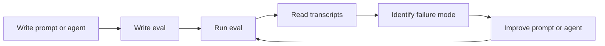

AI coding tools produce non-deterministic output. Evals make that output observable and measurable using three grading layers: deterministic checks, transcript analysis, and LLM rubrics.

This guide is for teams building AI coding tools and platform teams providing
shared AI enablement infrastructure. For team-specific eval setup, see
Team AI Evals. For platform-scale patterns, see
AI Evals for AI Enablement Platforms.

## Terminology

| Term               | Definition                                                      |
| ------------------ | --------------------------------------------------------------- |
| Task               | A single work item given to the agent (one prompt + one fixture) |
| Trial              | One execution of a task; multiple trials measure variance        |
| Grader             | An automated check that scores agent output (pass/fail or 0-1)  |
| Transcript         | The full agent conversation log: tool calls, reasoning, output   |
| Outcome            | The agent's final output for a task                              |
| Evaluation harness | The framework that runs tasks, collects outcomes, applies graders |
| Agent harness      | The runtime that executes the agent (e.g., Claude Code)          |
| Evaluation suite   | A collection of related tasks testing one capability dimension   |

**In the [dev-plugins](https://github.com/bailejl/dev-plugins) reference implementation:** Promptfoo is the evaluation harness. Claude Code is the agent
harness. YAML files in `evals/<plugin>/suites/` are evaluation suites.

## What Are AI Evals

AI coding tools produce non-deterministic output. The same prompt run twice can yield
different code, different explanations, and different tool-use sequences. Traditional
unit tests verify deterministic application logic. AI evals verify _behavior_: whether
an agent finds the right issues, follows a sound process, and produces useful output.

Without evals, teams face:

- **Silent regressions**: A prompt change that improves one scenario quietly breaks three others. Nobody notices until a user reports it.
- **Hallucination drift**: The agent starts citing files that do not exist or inventing issues that are not present. Without negative tests, fabrication goes undetected.
- **Unmeasurable improvement**: Every change is a guess. You cannot tell whether a prompt edit actually improved capability or just shifted failure modes.

Evals make AI tool quality observable and measurable.

This guide focuses on evals for coding and code review agents, tools that read
code, produce findings, and generate or modify source files. Conversational agents
and research agents have different evaluation needs and may require adapted
approaches.

## What Evals Validate: ACD Artifacts

In the Agentic Continuous Delivery framework, software
delivery is organized around six
first-class artifacts. Evals validate
agent behavior against these artifacts. Each grading layer maps naturally to
different artifact types.

| Artifact             | Description                                     | Primary Eval Layer |
| -------------------- | ----------------------------------------------- | ------------------ |
| Intent Description   | What the user wants to achieve                  | LLM Rubric         |
| User-Facing Behavior | Observable outcomes from the user's perspective | LLM Rubric         |
| Feature Description  | Structured specification of a capability        | Transcript         |
| Executable Truth     | Tests, build scripts, type checks               | Deterministic      |
| System Constraints   | Security, performance, compliance rules         | Transcript         |
| Implementation       | Source code and configuration                   | Deterministic      |

**Reading the table:** Deterministic graders excel at checking artifacts with
verifiable ground truth (code compiles, tests pass, files exist). Transcript
graders verify the agent respected process constraints and addressed structured
specifications. LLM rubrics evaluate alignment with intent and user-facing quality,
the artifacts that require judgment.

This mapping guides grader selection: when you know which artifact type your eval
targets, the table tells you which grading layer is the primary fit.

## The Eval Development Cycle

Evals are a development tool, not a post-hoc quality gate. The cycle looks like this:

The key insight: you write the eval _before_ you consider the prompt done. Running the
eval, reading the full agent transcript, and understanding _why_ it failed teaches you
more about your prompt than any amount of manual testing. The eval is your feedback loop.

## Three-Layer Grading

A single grading approach cannot cover the full range of AI tool behaviors. Deterministic
checks are fast but shallow. LLM judges catch nuance but are slow and expensive. Transcript
analysis validates the agent's process independent of its output. Combining all three
layers gives you coverage, speed, and accuracy.

### Layer 1: Deterministic Graders

Deterministic graders run fast, produce binary pass/fail results, and have near-zero
false positive rates. They check structural properties of the output.

**What they check:**

- Report structure matches expected headings and sections
- Scores add up correctly (weighted arithmetic validation)
- Output references real files from the fixture, not hallucinated paths
- Specific keywords or patterns appear (or do not appear) in the output

A score arithmetic grader parses category scores and weights from agent output, computes the weighted average, and compares it to the reported overall score. A small tolerance (e.g., +/- 3 points) accommodates rounding. This catches a common failure mode: the agent reports individual category scores and a total that do not add up.

A report structure grader validates that the output contains required headings at the correct level, that headings match expected patterns, that required sections have non-empty content, and that the output falls within length bounds.

### Layer 2: Transcript Graders

Transcript graders validate _how_ the agent worked, not just what it produced. They parse
the agent's tool-call sequence and conversation turns to verify sound process.

**What they check:**

- The agent gathered evidence (Read, Glob, Grep, Bash) before stating findings
- The agent used multiple evidence sources, not just one
- Evidence-gathering actions make up a sufficient proportion of total actions

An evidence gathering grader checks three things: whether evidence-gathering tools (Read, Glob, Grep) were used before the agent stated findings, whether at least two different evidence tools were used, and whether evidence-gathering actions make up a sufficient proportion of total actions (e.g., at least 40%). This catches agents that jump to conclusions without reading the code, or that rely on a single tool without examining actual file contents.

### Layer 3: LLM Rubrics

LLM rubrics use a language model as judge to evaluate qualities that resist
deterministic checking: accuracy of findings, quality of recommendations, appropriate
severity ratings, and absence of hallucination.

A typical code quality rubric defines weighted criteria such as correctness, readability, maintainability, idiomatic usage, and error handling, each scored on a 1-5 scale. The LLM judge scores each criterion, a weighted total is computed, and the result passes if it meets a threshold (e.g., 3.5 out of 5).

LLM rubrics are the slowest and most expensive grading layer. Use them for qualities
that the other layers cannot check.

### Human Review as Calibration

Human review is a calibration tool, not a fourth runtime layer. You do not include
human review in the automated eval pipeline. Instead, you use human review
periodically to verify that your graders are correctly calibrated.

The CORE-Bench study found that fixing grader bugs improved measured performance
from 42% to 95%. Uncalibrated graders waste prompt engineering effort on problems
that do not exist.

For the hands-on calibration process and recalibration triggers, see
Calibrating Graders.

### Decision Table: When to Use Each Layer

| Question                                    | Layer         |
| ------------------------------------------- | ------------- |
| Does the output have the right structure?   | Deterministic |
| Do the numbers add up?                      | Deterministic |
| Does the output reference real files?       | Deterministic |
| Did the agent read the code before judging? | Transcript    |
| Did the agent use appropriate tools?        | Transcript    |
| Are the findings accurate and specific?     | LLM Rubric    |
| Are the recommendations actionable?         | LLM Rubric    |
| Is the severity rating appropriate?         | LLM Rubric    |

### Worked Example: Three Layers Combined

Consider a code review eval that sends a messy codebase to the agent (mixed naming conventions, duplicated logic, dead code, a god class). A single test case uses all three layers:

1. **Deterministic** (high weight): Checks that findings reference specific files and line numbers from the fixture, and that the report has the expected heading structure.

2. **Transcript** (medium weight): Verifies the agent read code files before producing findings.

3. **LLM Rubric** (high weight): Judges whether findings include specific file references and accurate descriptions, and whether recommendations are actionable rather than generic.

The deterministic graders run in milliseconds and catch structural failures. The transcript grader catches agents that skip evidence gathering. The LLM rubrics evaluate the subjective quality that only another language model can assess. Together, they cover structure, process, and quality.

## Positive and Negative Test Pairs

Every eval suite needs two types of tests:

**Positive (capability) tests** verify the tool finds real issues. You give the agent
a fixture with planted problems and assert that it detects them.

**Negative (regression) tests** verify the tool does not fabricate findings. You give
the agent a clean fixture and assert that it does not report false positives.

Without negative tests, you optimize for recall at the cost of precision. The agent
learns to report everything as a problem, including things that are fine. Without
positive tests, you have no idea whether the tool actually works.

**Naming convention:** Every positive suite file `suite.yaml` has a corresponding
`suite-neg.yaml`.

For a step-by-step walkthrough of building positive and negative test pairs, see
Writing Your First Eval.

## Fixture Design

Fixtures are the codebases your agent evaluates during testing. Their quality
determines your eval quality.

**Principles:**

- **Realistic, not toy.** Use code structures that resemble real projects. A single
  file with one obvious bug teaches you nothing about agent behavior on real codebases.

- **One scenario per test case.** Each test should exercise a single capability.
  This mirrors ACD's small-batch session
  pattern: one scenario per session keeps signal clean.

- **Planted issues with documented intent.** Every issue in a positive fixture should
  be deliberate and documented. List expected findings in the suite metadata or in a
  reference solution.

- **Clean fixtures for negative tests.** Build fixtures that follow best practices so
  you can verify the agent does not fabricate findings.

- **Diverse fixture types.** Different fixtures exercise different capabilities.

For a fixture portfolio example, see
Building a Fixture Matrix.

## Task Quality

Ambiguous task specifications are the primary source of eval noise. If two domain
experts would disagree on whether an agent's output passes or fails, the task is
underspecified, not the agent.

**The two-expert test:** Before finalizing an eval case, ask whether two domain
experts given the same output would independently reach the same pass/fail verdict.
If not, tighten the specification.

**Writing unambiguous assertions:**

- **Specific over generic.** "Detects missing `<label>` on the email input" is
  testable. "Finds accessibility issues" is not.
- **Observable criteria.** Assert on things you can check (keywords present,
  files referenced, structure correct), not on vague quality.
- **Reference solutions as disambiguation.** When a task could be interpreted
  multiple ways, write a reference solution that documents the intended
  interpretation. The reference eliminates ambiguity.

**When pass rates are zero:** A 0% pass rate is usually a task bug, not an agent
bug. Before blaming the agent, investigate the task specification and grader logic.
Common causes: overly narrow regex assertions, graders checking the wrong field,
or fixture content that does not match the prompt's assumptions.

## Metrics: pass@k and pass^k

Single-run pass rates are misleading for non-deterministic systems. A test that passes
once might fail on the next run. Two metrics address this:

**pass@k** (capability ceiling): The probability that at least 1 of k independent runs
passes. Computed as `1 - C(n-c, k) / C(n, k)` where n is total runs and c is passing
runs. This tells you what the agent _can_ do on a good run.

**pass^k** (reliability floor): The probability that all k independent runs pass.
Computed as `C(c, k) / C(n, k)`. This tells you how consistently the agent succeeds.

**Why you need both:**

- High pass@k, low pass^k: The agent has the capability but is unreliable. Focus on
  reducing variance (better prompts, more constrained output format).
- Low pass@k, low pass^k: The agent lacks the capability. Focus on improving the
  prompt or agent architecture.
- High pass@k, high pass^k: The agent reliably performs this task. Move on.

**Reference targets** (from this repo's eval philosophy):

| Metric                | Target |
| --------------------- | ------ |
| pass@1                | > 80%  |
| pass@5                | > 95%  |
| pass^5                | > 60%  |
| Negative suite pass@1 | > 90%  |

Most eval frameworks support computing both metrics from multi-trial output, with optional grouping by suite or eval type.

## Reference Solutions

Reference solutions are gold-standard outputs that document what a correct response
looks like for each fixture. They serve two purposes:

1. **Grader calibration.** Compare agent output against the reference to verify your
   graders catch real failures and do not flag correct behavior.

2. **LLM judge anchoring.** Provide the reference solution to LLM rubric graders so
   they have a concrete standard to judge against, reducing variance in LLM-as-judge
   scoring.

Each reference solution covers one fixture and documents the expected findings, their
severities, and the evidence that supports them.

## Common Pitfalls

**Only positive tests.** The agent gets rewarded for finding issues everywhere,
including in clean code. Add negative test suites.

**Only LLM rubrics.** Slow, expensive, and variable. Start with deterministic
graders for structural checks and add LLM rubrics only for qualities that resist
deterministic evaluation.

**Toy fixtures.** A 10-line file with one obvious bug does not test real-world
agent behavior. Build fixtures that resemble actual codebases.

**Single-run evaluation.** One passing run does not mean the agent works. Use
multi-trial execution and pass@k/pass^k metrics to measure true capability and
reliability.

**Not reading transcripts.** The transcript shows you _why_ the agent failed, not
just _that_ it failed. Read transcripts after every eval run. They are the primary
debugging tool.

## Related Content

- Team AI Evals for Coding Tools - Setting up evals for your team's AI coding tools
- AI Evals for AI Enablement Platforms - Building shared eval infrastructure for reusable AI tools
- Agent Delivery Contract - ACD's six artifact types that evals validate
- Pipeline Enforcement - How quality gates enforce ACD constraints
- Coding and Review Setup - Configuring AI agents for coding and review workflows
