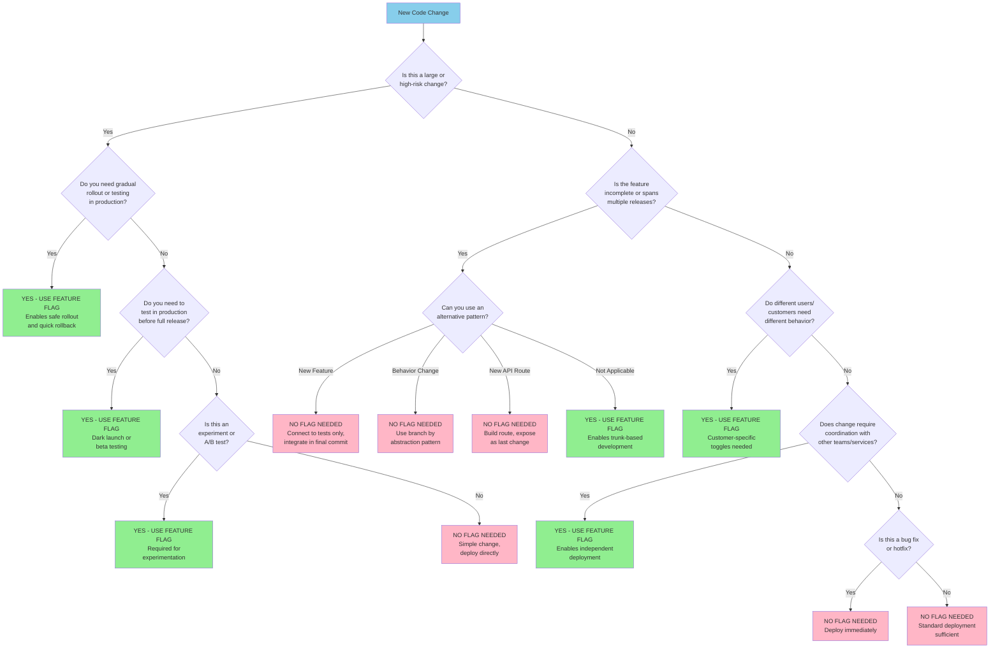

**Phase 3 - Optimize** | 

Feature flags are the mechanism that makes trunk-based development and small batches safe. They let you deploy code to production without exposing it to users, enabling dark launches, gradual rollouts, and instant rollback of features without redeploying.

## Why Feature Flags?

In continuous delivery, deployment and release are two separate events:

- **Deployment** is pushing code to production.
- **Release** is making a feature available to users.

Feature flags are the bridge between these two events. They let you deploy frequently (even multiple times a day) without worrying about exposing incomplete or untested features. This separation is what makes continuous deployment possible for teams that ship real products to real users.

## When You Need Feature Flags (and When You Don't)

Not every change requires a feature flag. Flags add complexity, and unnecessary complexity slows you down. Use this decision tree to determine the right approach.

### Decision Tree

### Alternatives to Feature Flags

| Technique | How It Works | When to Use |
|-----------|-------------|-------------|
| **Branch by Abstraction** | Introduce an abstraction layer, build the new implementation behind it, switch when ready | Replacing an existing subsystem or library |
| **Connect Tests Last** | Build internal components without connecting them to the UI or API | New backend functionality that has no user-facing impact until connected |
| **Dark Launch** | Deploy the code path but do not route any traffic to it | New infrastructure, new services, or new endpoints that are not yet referenced |

These alternatives avoid the lifecycle overhead of feature flags while still enabling trunk-based development with incomplete work.

## Implementation Approaches

Feature flags can be implemented at different levels of sophistication. Start simple and add complexity only when needed.

### Level 1: Static Code-Based Flags

The simplest approach: a boolean constant or configuration value checked in code.

# config.py
FEATURE_NEW_CHECKOUT = False

# checkout.py
from config import FEATURE_NEW_CHECKOUT

def process_checkout(cart, user):
    if FEATURE_NEW_CHECKOUT:
        return new_checkout_flow(cart, user)
    else:
        return legacy_checkout_flow(cart, user)

**Pros:** Zero infrastructure. Easy to understand. Works everywhere.

**Cons:** Changing a flag requires a deployment. No per-user targeting. No gradual rollout.

**Best for:** Teams starting out. Internal tools. Changes that will be fully on or fully off.

### Level 2: Dynamic In-Process Flags

Flags stored in a configuration file, database, or environment variable that can be changed at runtime without redeploying.

# flag_service.py
import json

class FeatureFlags:
    def __init__(self, config_path="/etc/flags.json"):
        self._config_path = config_path

    def is_enabled(self, flag_name, context=None):
        flags = json.load(open(self._config_path))
        flag = flags.get(flag_name, {})

        if not flag.get("enabled", False):
            return False

        # Percentage rollout
        if "percentage" in flag and context and "user_id" in context:
            return (hash(context["user_id"]) % 100) < flag["percentage"]

        return True

{
  "new-checkout": {
    "enabled": true,
    "percentage": 10
  }
}

**Pros:** No redeployment needed. Supports percentage rollout. Simple to implement.

**Cons:** Each instance reads its own config - no centralized view. Limited targeting capabilities.

**Best for:** Teams that need gradual rollout but do not want to adopt a third-party service yet.

### Level 3: Centralized Flag Service

A dedicated service (self-hosted or SaaS) that manages all flags, provides a dashboard, supports targeting rules, and tracks flag usage.

**Examples:** LaunchDarkly, Unleash, Flagsmith, Split, or a custom internal service.

from feature_flag_client import FlagClient

client = FlagClient(api_key="...")

def process_checkout(cart, user):
    if client.is_enabled("new-checkout", user_context={"id": user.id, "plan": user.plan}):
        return new_checkout_flow(cart, user)
    else:
        return legacy_checkout_flow(cart, user)

**Pros:** Centralized management. Rich targeting (by user, plan, region, etc.). Audit trail. Real-time changes.

**Cons:** Added dependency. Cost (for SaaS). Network latency for flag evaluation (mitigated by local caching in most SDKs).

**Best for:** Teams at scale. Products with diverse user segments. Regulated environments needing audit trails.

### Level 4: Infrastructure Routing

Instead of checking flags in application code, route traffic at the infrastructure level (load balancer, service mesh, API gateway).

# Istio VirtualService example
apiVersion: networking.istio.io/v1alpha3
kind: VirtualService
metadata:
  name: checkout-service
spec:
  hosts:
    - checkout
  http:
    - match:
        - headers:
            x-feature-group:
              exact: "beta"
      route:
        - destination:
            host: checkout-v2
    - route:
        - destination:
            host: checkout-v1

**Pros:** No application code changes. Clean separation of routing from logic. Works across services.

**Cons:** Requires infrastructure investment. Less granular than application-level flags. Harder to target individual users.

**Best for:** Microservice architectures. Service-level rollouts. A/B testing at the infrastructure layer.

## Feature Flag Lifecycle

Every feature flag has a lifecycle. Flags that are not actively managed become technical debt. Follow this lifecycle rigorously.

### The Stages

1. CREATE       → Define the flag, document its purpose and owner
2. DEPLOY OFF   → Code ships to production with the flag disabled
3. BUILD        → Incrementally add functionality behind the flag
4. DARK LAUNCH  → Enable for internal users or a small test group
5. ROLLOUT      → Gradually increase the percentage of users
6. REMOVE       → Delete the flag and the old code path

#### Stage 1: Create

Before writing any code, define the flag:

- **Name:** Use a consistent naming convention (e.g., `enable-new-checkout`, `feature.discount-engine`)
- **Owner:** Who is responsible for this flag through its lifecycle?
- **Purpose:** One sentence describing what the flag controls
- **Planned removal date:** Set this at creation time. Flags without removal dates become permanent.

#### Stage 2: Deploy OFF

The first deployment includes the flag check but the flag is disabled. This verifies that:

- The flag infrastructure works
- The default (off) path is unaffected
- The flag check does not introduce performance issues

#### Stage 3: Build Incrementally

Continue building the feature behind the flag over multiple deploys. Each deploy adds more functionality, but the flag remains off for users. Test both paths in your automated suite:

@pytest.mark.parametrize("flag_enabled", [True, False])
def test_checkout_with_flag(flag_enabled, monkeypatch):
    monkeypatch.setattr(flags, "is_enabled", lambda name, ctx=None: flag_enabled)
    result = process_checkout(cart, user)
    assert result.status == "success"

#### Stage 4: Dark Launch

Enable the flag for internal users or a specific test group. This is your first validation with real production data and real traffic patterns. Monitor:

- Error rates for the flagged group vs. control
- Performance metrics (latency, throughput)
- Business metrics (conversion, engagement)

#### Stage 5: Gradual Rollout

Increase exposure systematically:

| Step | Audience | Duration | What to Watch |
|------|----------|----------|---------------|
| 1 | 1% of users | 1-2 hours | Error rates, latency |
| 2 | 5% of users | 4-8 hours | Performance at slightly higher load |
| 3 | 25% of users | 1 day | Business metrics begin to be meaningful |
| 4 | 50% of users | 1-2 days | Statistically significant business impact |
| 5 | 100% of users | - | Full rollout |

At any step, if metrics degrade, roll back by disabling the flag. No redeployment needed.

#### Stage 6: Remove

This is the most commonly skipped step, and skipping it creates significant technical debt.

Once the feature has been stable at 100% for an agreed period (e.g., 2 weeks):

1. Remove the flag check from code
2. Remove the old code path
3. Remove the flag definition from the flag service
4. Deploy the simplified code

**Set a maximum flag lifetime.** A common practice is 90 days. Any flag older than 90 days triggers an automatic review. Stale flags are a maintenance burden and a source of confusion.

### Lifecycle Timeline Example

| Day | Action | Flag State |
|-----|--------|------------|
| 1 | Deploy flag infrastructure and create removal ticket | OFF |
| 2-5 | Build feature behind flag, integrate daily | OFF |
| 6 | Enable for internal users (dark launch) | ON for 0.1% |
| 7 | Enable for 1% of users | ON for 1% |
| 8 | Enable for 5% of users | ON for 5% |
| 9 | Enable for 25% of users | ON for 25% |
| 10 | Enable for 50% of users | ON for 50% |
| 11 | Enable for 100% of users | ON for 100% |
| 12-18 | Stability period (monitor) | ON for 100% |
| 19-21 | Remove flag from code | DELETED |

**Total lifecycle: approximately 3 weeks from creation to removal.**

## Long-Lived Feature Flags

Not all flags are temporary. Some flags are intentionally permanent and should be managed differently from release flags.

### Operational Flags (Kill Switches)

**Purpose:** Disable expensive or non-critical features under load during incidents.

**Lifecycle:** Permanent.

**Management:** Treat as system configuration, not as a release mechanism.

# PERMANENT FLAG - System operational control
# Used to disable expensive features during incidents
if flags.is_enabled("enable-recommendations"):
    recommendations = compute_recommendations(user)
else:
    recommendations = []  # Graceful degradation under load

### Customer-Specific Toggles

**Purpose:** Different customers receive different features based on their subscription or contract.

**Lifecycle:** Permanent, tied to customer configuration.

**Management:** Part of the customer entitlement system, not the feature flag system.

# PERMANENT FLAG - Customer entitlement
# Controlled by customer subscription level
if customer.subscription.includes("analytics"):
    show_advanced_analytics(customer)

### Experimentation Flags

**Purpose:** A/B testing and experimentation.

**Lifecycle:** The flag infrastructure is permanent, but individual experiments expire.

**Management:** Each experiment has its own expiration date and success criteria. The experimentation platform itself persists.

# PERMANENT FLAG - Experimentation platform
# Individual experiments expire, platform remains
variant = experiments.get("checkout-optimization")
if variant == "streamlined":
    return streamlined_checkout(cart, user)
else:
    return standard_checkout(cart, user)

### Managing Long-Lived Flags

Long-lived flags need different discipline than temporary ones:

- **Use a separate naming convention** (e.g., `KILL_SWITCH_*`, `ENTITLEMENT_*`) to distinguish them from temporary release flags
- **Document why each flag is permanent** so future team members understand the intent
- **Store them separately** from temporary flags in your management system
- **Review regularly** to confirm they are still needed

## Key Pitfalls

### 1. "We have 200 feature flags and nobody knows what they all do"

This is flag debt, and it is as damaging as any other technical debt. Prevent it by enforcing the lifecycle: every flag has an owner, a purpose, and a removal date. Run a monthly flag audit.

### 2. "We use flags for everything, including configuration"

Feature flags and configuration are different concerns. Flags are temporary (they control unreleased features). Configuration is permanent (it controls operational behavior like timeouts, connection pools, log levels). Mixing them leads to confusion about what can be safely removed.

### 3. "Testing both paths doubles our test burden"

It does increase test effort, but this is a temporary cost. When the flag is removed, the extra tests go away too. The alternative - deploying untested code paths - is far more expensive.

### 4. "Nested flags create combinatorial complexity"

Avoid nesting flags whenever possible. If feature B depends on feature A, do not create a separate flag for B. Instead, extend the behavior behind feature A's flag. If you must nest, document the dependency and test the specific combinations that matter.

## Flag Removal Anti-Patterns

These specific patterns are the most common ways teams fail at flag cleanup.

**Don't skip the removal ticket:**

- WRONG: "We'll remove it later when we have time"
- RIGHT: Create a removal ticket at the same time you create the flag

**Don't leave flags after full rollout:**

- WRONG: Flag still in code 6 months after 100% rollout
- RIGHT: Remove within 2-4 weeks of full rollout

**Don't forget to remove the old code path:**

- WRONG: Flag removed but old implementation still in the codebase
- RIGHT: Remove the flag check AND the old implementation together

**Don't keep flags "just in case":**

- WRONG: "Let's keep it in case we need to roll back in the future"
- RIGHT: After the stability period, rollback is handled by deployment, not by re-enabling a flag

## Measuring Success

| Metric | Target | Why It Matters |
|--------|--------|----------------|
| Active flag count | Stable or decreasing | Confirms flags are being removed, not accumulating |
| Average flag age | < 90 days | Catches stale flags before they become permanent |
| Flag-related incidents | Near zero | Confirms flag management is not causing problems |
| Time from deploy to release | Hours to days (not weeks) | Confirms flags enable fast, controlled releases |

## Next Step

Small batches and feature flags let you deploy more frequently, but deploying more means more work in progress. Limiting WIP ensures that increased deploy frequency does not create chaos.

## Related Content

- Fear of Deploying - a symptom that feature flags help eliminate by making deployments reversible
- Infrequent Releases - the symptom of batching releases that flags help break
- Small Batches - the practice that feature flags make safe for incomplete work
- Progressive Rollout - the deployment strategy that builds on feature flag capabilities
- Trunk-Based Development - the branching strategy that feature flags enable
- Limiting WIP - the next step after feature flags to manage increased deployment frequency
- Hypothesis-Driven Development - using feature flags to control experiment exposure
