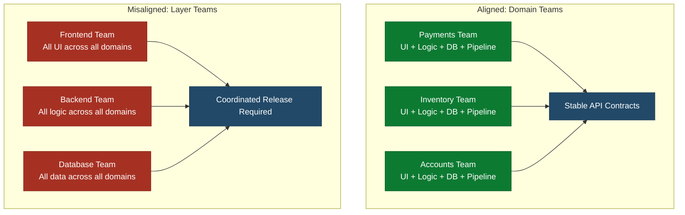

**Phase 3 - Optimize** |  | Teams that own a domain end-to-end can deploy independently. Teams organized around technical layers cannot.

## How Team Structure Shapes Code

The way an organization communicates produces the architecture it builds. When communication flows
between layers - frontend team talks to backend team, backend team talks to database team - the
software reflects those communication lines. Requests for the UI layer go to one team. Requests for
the API layer go to another. The result is software that is horizontally layered in the same pattern
as the organization.

Layer teams produce layered architectures. The layers are coupled not because the engineers chose
to couple them but because every feature requires coordination across team boundaries. The coupling
is structural, not accidental.

Domain teams produce domain boundaries. When one team owns everything inside a business domain -
the user interface, the business logic, the data store, and the deployment pipeline - they can
make changes within that domain without coordinating with other teams. The interfaces between
domains are explicit and stable because that is how the teams communicate.

This is not a coincidence. Architecture reflects the ownership structure of the people who built
it.

## What Aligned Ownership Looks Like

A team with aligned ownership can answer yes to all of the following:

- Can this team deploy a change to production without waiting for another team?
- Does this team own everything inside its domain boundary - all layers, all data, and all consumer interfaces?
- Does this team define and version the contracts its domain exposes to other domains?
- Is this team responsible for production incidents in its domain?

Two team patterns achieve aligned ownership in practice.

A full-stack product team owns the complete user-facing surface for a feature area - from
the UI components a user interacts with down through the business logic and the database. The team
has no hard dependency on a separate frontend or backend team. One team ships the entire vertical
slice.

A subdomain product team owns a service or set of services representing a bounded business
capability. Some subdomain teams own a user-facing surface alongside their backend logic. Others -
a tax calculation service, a shipping rates engine, an identity provider - have no UI at all.
Their consumer interface is entirely an API, consumed by other teams rather than by end users
directly. Both are fully aligned: the team owns everything within the boundary, and the boundary
is what its consumers depend on - whether that is a UI, an API, or both. A slice is done when the
consumer interface satisfies the agreed behavior for its callers.

Both patterns share the same structure: **one team, one deployable, full ownership**. The team
owns all layers within its boundary, the authority to deploy that boundary independently, and
accountability for its operational behavior.

## What Misalignment Looks Like

Three patterns consistently produce deployment coupling.

**Component or layer teams.** A frontend team, a backend team, and a database team all work on the
same product. Every feature requires coordination across all three. No team can deploy
independently because no team owns a full vertical slice.

**Feature teams without domain ownership.** Teams are organized around feature areas, but each
feature area spans multiple services owned by other teams. The feature team coordinates with
service owners for every change. The service owners become a shared resource that feature teams
queue against.

**The pillar model.** A platform team owns all infrastructure. A shared services team owns
cross-cutting concerns. Product teams own the business logic but depend on the other two for
deployment. A change that touches infrastructure or shared services requires the product team to
file a ticket and wait.

The telltale sign in all three cases: a team cannot estimate their own delivery date because it
depends on other teams' schedules.

## The Relationship Between Team Alignment and Architecture

Team alignment and architecture reinforce each other. A decoupled architecture makes it possible
to draw clean team boundaries. Clean team boundaries prevent the architecture from recoupling.

When team boundaries and code boundaries match:

- Each team modifies code that only they own. Merge conflicts between teams disappear.
- Each team's pipeline validates only their domain. Shared pipeline queues disappear.
- Each team deploys on their own schedule. Release trains disappear.

When they do not match, architecture and ownership drift together. A team that technically "owns"
a service but in practice coordinates with three other teams for every change is not an independent
deployment unit regardless of what the org chart says.

See Architecture Decoupling for the technical strategies to establish
independent service boundaries. See Tightly Coupled Monolith
for the architecture anti-pattern that misaligned ownership produces over time.

## How to Align Teams to Code

### Step 1: Map who modifies what

Before changing anything, understand the actual ownership pattern. Use commit history to identify
which teams (or individuals acting as de facto teams) modify which files and services.

1. Pull commit history for the last three months: `git log --format="%ae %f" | sort | uniq -c`
2. Map authors to their team. Identify the files each team touches most.
3. Highlight files that multiple teams touch frequently. These are the coupling points.
4. Identify services or modules where changes from one team consistently require changes from another.

The result is a map of actual ownership versus nominal ownership. In most organizations these
diverge significantly.

### Step 2: Identify natural domain boundaries

Natural domain boundaries exist in most codebases - they are just not enforced by team structure.
Look for:

- **Business capabilities.** What does this system do? Separate business functions - billing,
  shipping, authentication, reporting - that could be operated independently are candidate domains.
- **Data ownership.** Which tables or data stores does each part of the system read and write?
  Data that is exclusively owned by one functional area belongs in that domain.
- **Rate of change.** Code that changes weekly for business reasons and code that changes monthly
  for infrastructure reasons should be in different domains with different teams.
- **Existing team knowledge.** Where do engineers already have strong concentrated expertise?
  Domain boundaries often match knowledge boundaries.

Draw a candidate domain map. Each domain should be a bounded set of business capability that one
team can own end-to-end. Do not force domains to map to the current team structure - let the
business capabilities define the boundaries first.

### Step 3: Assign end-to-end ownership

For each candidate domain identified in Step 2, assign a single team. The rules:

- **One team per domain.** Shared ownership produces neither ownership. If a domain has two owners,
  pick one.
- **Full stack.** The owning team is responsible for all layers within the domain - UI, logic, data.
  If the current team lacks skills at some layer, plan for cross-training or re-staffing, but do
  not address the skill gap by keeping a separate layer team.
- **Deployment authority.** The owning team merges to trunk and controls the deployment pipeline for
  their domain. No other team can block their deployment.
- **Operational accountability.** The owning team is paged for production issues in their domain.
  On-call for the domain is owned by the same people who build it.

Document the domain boundaries explicitly: what services, data stores, and interfaces belong to
each team.

### Step 4: Define contracts at boundaries

Once teams own their domains, the interfaces between domains must be made explicit. Implicit
interfaces - shared databases, undocumented internal calls, assumed response shapes - break
independent deployment.

For each boundary between domains:

1. **API contracts.** Define the request and response shapes the consuming team depends on.
   Use OpenAPI or an equivalent schema. Commit it to the producer's repository.
2. **Event contracts.** For asynchronous communication, define the event schema and the guarantees
   the producer makes (ordering, at-least-once vs. exactly-once, schema evolution rules).
3. **Versioning.** Establish a versioning policy. Additive changes are non-breaking. Removing or
   changing field semantics requires a new version. Both old and new versions are supported for a
   defined deprecation period.
4. **Contract tests.** Write tests that verify the producer honors the contract. Write tests that
   verify the consumer handles the contract correctly. See Contract Testing
   for implementation guidance.

Teams should not proceed to separate deployment pipelines until contracts are explicit and tested.
An implicit contract that breaks silently is worse than a coordinated deployment.

### Step 5: Separate deployment pipelines

With explicit contracts in place, each team can operate an independent pipeline for their domain.

- Each team's pipeline validates only their domain's tests and contracts.
- Pipeline triggers are scoped to the files the team owns - changes to another domain's files do
  not trigger this team's pipeline.
- Each team deploys from their pipeline on their own schedule, without waiting for other teams.

For teams that share a repository but own distinct domains, use path-filtered triggers and separate
pipeline configurations. See Multiple Teams, Single Deployable
for a worked example of this pattern when teams share a modular monolith.

| Objection | Response |
|-----------|----------|
| "We don't have enough senior engineers to staff every domain team fully." | Domain teams do not need to be large. A team of two to three engineers with full ownership of a well-scoped domain delivers faster than six engineers on a layer team waiting for each other. Start with the highest-priority domains and staff others incrementally. |
| "Our engineers are specialists. The frontend people can't own database code." | Ownership does not require equal expertise at every layer - it requires the team to be responsible and to develop capability over time. Pair frontend specialists with backend engineers on the same team. The skill gap closes faster inside a team than across team boundaries. |
| "We tried domain teams before and they reinvented everything separately." | Reinvention happens when platform capabilities are not shared effectively, not because of domain ownership. Separate domain ownership (what business capabilities each team is responsible for) from platform ownership (shared infrastructure, frameworks, and observability tooling). |
| "Business stakeholders are used to requesting work from the layer teams." | Stakeholders adapt quickly when domain teams ship faster and with less coordination. Reframe the conversation: stakeholders talk to the team that owns the outcome, not the team that owns the layer. |
| "Our architecture doesn't have clean domain boundaries yet." | Start with the organizational change anyway. Teams aligned to emerging domain boundaries will drive the architectural cleanup faster than a centralized architecture effort without aligned ownership. The two reinforce each other. |

## Measuring Success

| Metric | Target | Why It Matters |
|--------|--------|----------------|
| Deployment frequency per team | Increasing per team | Confirms teams can deploy without waiting for others |
| Cross-team dependencies per feature | Decreasing toward zero | Confirms domain boundaries are holding |
| Development cycle time | Decreasing | Teams that own their domain wait on fewer external dependencies |
| Production incidents attributed to another team's change | Decreasing | Confirms ownership boundaries match deployment boundaries |
| Teams blocked on a release window they did not control | Decreasing toward zero | The primary organizational symptom of misalignment |

## Related Content

- Architecture Decoupling - the technical counterpart to team alignment; both must move together
- Multiple Teams, Single Deployable - pipeline pattern for teams sharing a modular monolith before full service separation
- Horizontal Slicing - the work decomposition anti-pattern that layer team structures encourage
- Tightly Coupled Monolith - the architecture anti-pattern that misaligned team ownership produces
- Thin Spread Teams - the organizational anti-pattern of distributing engineers too thin across too many services
- Work Decomposition - how to slice work vertically within a team's domain boundary
- Contract Testing - how to define and enforce the contracts between domain teams
