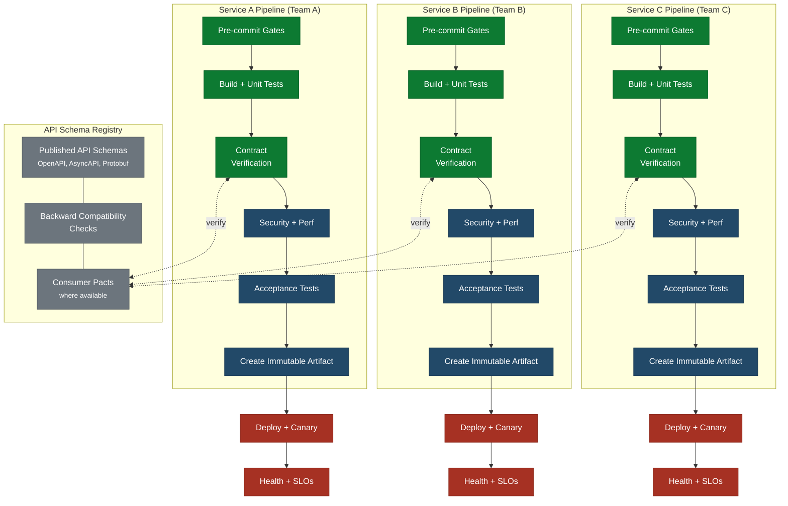

This is the target architecture for continuous delivery at scale. Each team owns an
independently deployable service with its own pipeline, its own release cadence, and
its own path to production. No team waits for another team to deploy. No integration
pipeline serializes their work. The only shared infrastructure is the API contract
layer that defines how services communicate.

This architecture demands disciplined API management. Without it, independent deployment
is an illusion - teams deploy whenever they want, but they break each other constantly.

  Pre-Feature Gate
  Team Pipeline
  API Schema Registry
  Production

## Key Characteristics

- **Fully independent deployment**: Each team deploys on its own schedule. Team A can
  deploy ten times a day while Team C deploys once a week. No coordination is required.
- **No shared integration pipeline**: There is no fan-in step. Each pipeline goes
  straight from artifact creation to production. This eliminates the integration bottleneck
  entirely.
- **Contract tests replace integration tests**: Instead of testing all services together,
  each team verifies its API contracts independently. The level of contract verification
  depends on how much coordination is possible between teams (see
  [contract verification approaches](#contract-verification-approaches) below).
- **Each team owns its full pipeline**: From pre-commit to production monitoring. No
  shared pipeline definitions, no central platform team gating deployments.

## Why API Management Is Critical

Independent deployment only works when teams can change their service without breaking
others. This requires a shared understanding of API boundaries that is enforced
automatically, not through meetings or documents that drift.

**Without API management, independent pipelines create independent failures.** Teams
deploy incompatible changes, discover the breakage in production, and revert to
coordinated releases to stop the bleeding. This is worse than the multi-team architecture
because it creates the illusion of independence while delivering the reliability of chaos.

### What API Management Requires

1. **Published API schemas**: Every service publishes its API contract (OpenAPI, AsyncAPI,
   Protobuf, or equivalent) as a versioned artifact. The schema is the source of truth for
   what the service provides.

2. **Contract verification** (see [approaches](#contract-verification-approaches) below):
   At minimum, providers verify backward compatibility against their own published schema.
   Where cross-team coordination is feasible, consumer-driven contracts add stronger
   guarantees.

3. **Backward compatibility enforcement**: Every API change is checked for backward
   compatibility against the published schema. Breaking changes require a new API version
   using the expand-then-contract pattern:
   - Deploy the new version alongside the old
   - Migrate consumers to the new version
   - Remove the old version only after all consumers have migrated

4. **Schema registry**: A central registry (Confluent Schema Registry, a simple artifact
   repository, or a Pact Broker where consumer-driven contracts are used) stores published
   schemas. Pipelines pull from this registry to run compatibility checks. The registry is
   shared infrastructure, but it does not gate deployments - it provides data that each
   team's pipeline uses to make its own go/no-go decision.

5. **API versioning strategy**: Teams agree on a versioning convention (URL path versioning,
   header versioning, or semantic versioning for message schemas) and enforce it through
   pipeline gates. The convention must be simple enough that every team follows it without
   deliberation.

### Contract Verification Approaches

Not all teams can coordinate on shared contract tooling. The right approach depends on
the relationship between provider and consumer teams. These approaches are listed from
least to most coordination required. Use the strongest approach your context supports.

| Approach | How It Works | Coordination Required | Best When |
|----------|-------------|----------------------|-----------|
| **Provider schema compatibility** | Provider's pipeline checks every change for backward compatibility against its own published schema (e.g., OpenAPI diff). No consumer involvement needed. | None between teams | Teams are in different organizations, or consumers are external/unknown |
| **Provider-maintained consumer tests** | Provider team writes tests that exercise known consumer usage patterns based on API analytics, documentation, or past breakage. | Minimal - provider observes consumers | Provider can see consumer traffic patterns but cannot require consumer participation |
| **Consumer-driven contracts** | Consumers publish pacts describing the subset of the provider API they depend on. Provider runs these pacts in its pipeline. See Contract Tests. | High - shared tooling, broker, and agreement to maintain pacts | Teams are in the same organization with shared tooling and willingness to maintain pacts |

Most organizations use a mix. Internal teams with shared tooling can adopt consumer-driven
contracts. Teams consuming third-party or cross-organization APIs use provider schema
compatibility checks and provider-maintained consumer tests.

The critical requirement is not which approach you use but that **every provider pipeline
verifies backward compatibility before deployment**. The minimum viable contract
verification is an automated schema diff against the published API - if the diff contains
a breaking change, the pipeline fails.

### Additional Quality Gates for Distributed Architectures

| Gate | Defect Sources Addressed | Catalog Section |
|------|--------------------------|-----------------|
| **Provider schema backward compatibility** | Interface mismatches from provider changes | Integration & Boundaries |
| **Consumer-driven contract verification** (where feasible) | Wrong assumptions about upstream/downstream | Integration & Boundaries |
| **API schema backward compatibility check** | Schema migration and backward compatibility failures | Data & State |
| **Cross-service timeout propagation check** | Missing timeout and deadline enforcement across boundaries | Performance & Resilience |
| **Circuit breaker and fallback verification** | Network partitions and partial failures handled wrong | Dependency & Infrastructure |
| **Distributed tracing validation** | Missing observability across service boundaries | Testing & Observability Gaps |

## When This Architecture Works

This architecture is the goal for organizations with:

- Multiple teams that need different deployment cadences
- Services with well-defined, stable API boundaries
- Teams mature enough to own their full delivery pipeline
- Investment in contract testing tooling and API governance

## When This Architecture Fails

- **Shared database schemas**: Multiple services can share a database engine without
  problems. The failure mode is shared schemas - when Service A and Service B both read
  from and write to the same tables, a schema migration by one service can break the
  other's queries. Each service must own its own schema. If two services need the same
  data, expose it through an API or event, not through direct table access.
- **Synchronous dependency chains**: If Service A calls Service B which calls Service C
  in the request path, a deployment of C can break A through B. Circuit breakers and
  fallbacks are required at every boundary, and contract tests must cover failure modes,
  not just success paths.
- **No contract verification discipline**: If teams skip backward compatibility checks
  or let contract test failures slide, breakage shifts from the pipeline to production.
  The architecture degrades into uncoordinated deployments with production as the
  integration environment. At minimum, every provider must run automated schema
  compatibility checks - even without consumer-driven contracts.
- **Missing observability**: When services deploy independently, debugging production
  issues requires distributed tracing, correlated logging, and SLO monitoring across
  service boundaries. Without this, independent deployment means independent
  troubleshooting with no way to trace cause and effect.

## Relationship to the Other Architectures

Architecture 3 is where Architecture 2 teams evolve to. The progression is:

1. **Single team, single deployable** - one team, one pipeline, one artifact
2. **Multiple teams, single deployable** - multiple teams, sub-pipelines, shared
   integration step
3. **Independent teams, independent deployables** - multiple teams, fully independent
   pipelines, contract-based integration

The move from 2 to 3 happens incrementally. Extract one service at a time. Give it
its own pipeline. Establish contract tests between it and the monolith. When the contract
tests are reliable, stop running the extracted service's code through the integration
pipeline. Repeat until the integration pipeline is empty.

## Related Content

- Quality Gates - the full gate sequence this pipeline applies
- Multiple Teams, Single Deployable - the pattern teams evolve from
- Contract Tests - contract testing patterns and examples
- Architecture Decoupling - how to extract services incrementally
- Premature Microservices - the risk of jumping to this architecture too early
