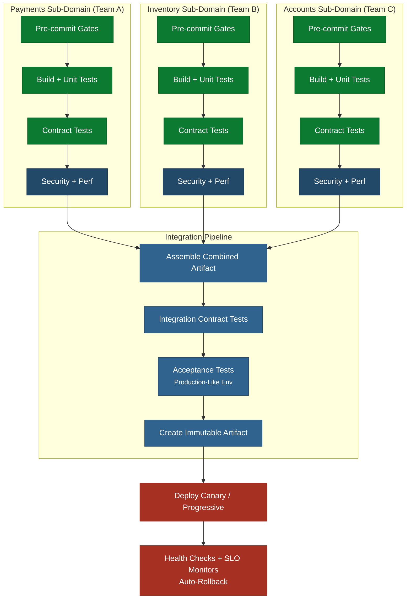

This architecture suits organizations where multiple teams contribute to a single
deployable modular monolith - a common
pattern for large applications, mobile apps, or platforms where the final artifact must
be assembled from team contributions.

The modular monolith structure is what makes multi-team ownership possible. Each team
owns a specific module representing a bounded sub-domain of the application. Team A
might own checkout and payments, Team B owns inventory and fulfillment, Team C owns
user accounts and authentication. Modules communicate through explicit internal APIs,
not by reaching into each other's database tables or calling private methods. Each
team's sub-pipeline validates only their module. A shared integration pipeline assembles
and verifies the combined result.

This ownership model is critical. Without clear module boundaries, teams step on each
other's code, sub-pipelines trigger on unrelated changes, and merge conflicts replace
pipeline contention as the bottleneck. The module split must follow the application's
domain boundaries, not its technical layers. A team that owns "the database layer" or
"the API controllers" will always be coupled to every other team. A team that owns
"payments" can change its database, API, and UI independently. If the codebase is not
yet structured as a modular monolith, restructure it before adopting this architecture

- otherwise the sub-pipelines will constantly interfere with each other.

## Key Characteristics

- **Module ownership by domain**: Each team owns a bounded module of the application's
  functionality. Ownership is defined by domain, not by technical layer. The team is
  responsible for all code, tests, and pipeline configuration within their module.
- **Team-owned sub-pipelines**: Each team runs their own pre-commit, build, unit test,
  contract test, and security gates independently. A team's sub-pipeline validates only
  their module and is their fast feedback loop.
- **Contract tests at both levels**: Teams run contract tests in their sub-pipeline to
  catch boundary issues at the module edges. The integration pipeline runs cross-module
  contract tests to verify the assembled result.
- **Integration pipeline is thin**: The integration pipeline does not re-run each team's
  tests. It validates only what cannot be validated in isolation - cross-module
  integration, the assembled artifact, and end-to-end acceptance tests.
- **Sub-pipeline target time**: Under 10 minutes. This is the team's primary feedback loop
  and must stay fast.
- **Integration pipeline target time**: Under 15 minutes. If it grows beyond this, the
  integration test suite needs decomposition or the application needs architectural changes
  to enable independent deployment.
- **Trunk-based development with path filters**: All teams commit to the same trunk.
  Sub-pipelines trigger based on path filters aligned to module boundaries, so a
  change to the payments module does not trigger the inventory sub-pipeline.

## Preventing the Integration Pipeline from Becoming a Bottleneck

The integration pipeline is a shared resource and the most likely bottleneck in this
architecture. To keep it fast:

1. **Move tests left into sub-pipelines**: Every test that can run in a sub-pipeline should
   run there. The integration pipeline should only contain tests that require the full
   assembled artifact.
2. **Use contract tests aggressively**: Contract tests in sub-pipelines catch most
   integration issues without needing the full system. The integration pipeline's contract
   tests are a verification layer, not the primary detection point.
3. **Run the integration pipeline on every commit to trunk**: Do not batch. Batching
   creates large changesets that are harder to debug when they fail.
4. **Parallelize acceptance tests**: Group acceptance tests by feature area and run groups
   in parallel.
5. **Monitor integration pipeline duration**: Set an alert if it exceeds 15 minutes. Treat
   this the same as a failing test - fix it immediately.

## When to Move Away from This Architecture

This architecture is a pragmatic pattern for organizations that cannot yet decompose their
monolith into independently deployable services. The long-term goal is
loose coupling -
independent services with independent pipelines that do not need a shared integration step.

Signs you are ready to decompose:

- Contract tests catch virtually all integration issues in sub-pipelines
- The integration pipeline adds little value beyond what sub-pipelines already verify
- Teams are blocked by integration pipeline queuing more than once per week
- Different parts of the application need different deployment cadences

## Related Content

- Quality Gates - the full gate sequence this pipeline applies
- Single Team, Single Deployable - the simpler pattern for one team
- Independent Teams, Independent Deployables - the target pattern when modules become independent services
- Modular Monolith - glossary definition
- Architecture Decoupling - how to move toward independent deployment
- Team Alignment to Code - how to structure teams around domain boundaries so this pipeline pattern works
