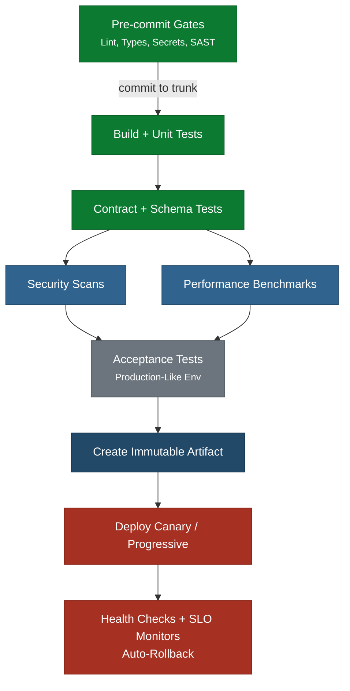

This architecture suits a team of up to 8-10 people owning a
modular monolith - a single deployable
application with well-defined internal module boundaries. The codebase is organized by
domain, not by technical layer. Each module encapsulates its own data, logic, and
interfaces, communicating with other modules through explicit internal APIs. The
application deploys as one unit, but its internal structure makes it possible to reason
about, test, and change one module without understanding the entire codebase. The pipeline
is linear with parallel stages where dependencies allow.

  Pre-Feature Gate
  CI Stage
  Parallel Verification
  Acceptance
  Production

## Key Characteristics

- **One pipeline, one artifact**: The entire application builds and deploys as a single
  immutable artifact. There is no fan-out or fan-in.
- **Linear with parallel branches**: Security scans and performance benchmarks run in
  parallel because neither depends on the other. Everything else is sequential.
- **Trunk-based development**: All developers commit to trunk at least daily. The pipeline
  runs on every commit.
- **Total target time**: Under 15 minutes from commit to production-ready artifact.
  Acceptance tests may extend this to 20 minutes for complex applications.
- **Ownership**: The team owns the pipeline definition, which lives in the same repository
  as the application code.

## When This Architecture Breaks Down

This architecture stops working when:

- The system becomes too large for a single team to manage.
- Build times extend along with the ability to respond quickly even after optimization
- Different parts of the application need different deployment cadences

When these symptoms appear, consider splitting into the
multi-team architecture or decomposing the application into
independently deployable services with their
own pipelines.

## Related Content

- Quality Gates - the full gate sequence this pipeline applies
- Multiple Teams, Single Deployable - the next pattern when one team is not enough
- Modular Monolith - glossary definition
- Pipeline Architecture - how to evolve pipeline architecture from entangled to loosely coupled
